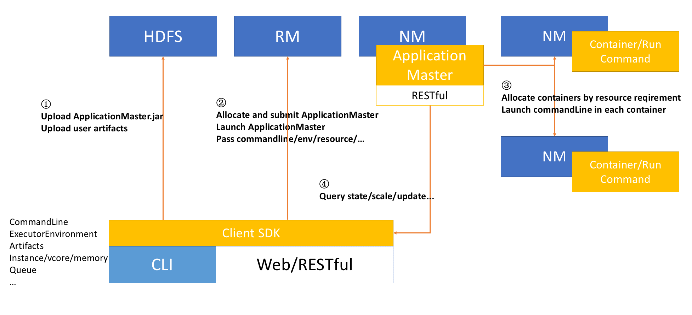
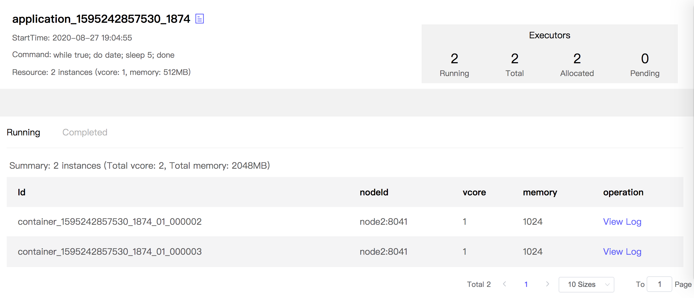

# marayarn

`marayarn`是`marathon-on-yarn`的简称，目标是在yarn资源管理框架下实现类似[marathon](https://github.com/mesosphere/marathon)的功能。

`marathon`是一款基于[Apache mesos](https://mesos.apache.org/)的，支持RESTful风格的资源调度平台。

`yarn`是hadoop2.0引入的资源管理框架，在yarn上一般运行`MapReduce`,`Spark`,`Flink`等计算框架。至今还没有一款类似marathon的调度平台，这就是本项目的意义。

项目目前仍然在开发阶段，已经实现的核心的功能包括：

1. 一个client sdk。支持提交一个命令到yarn上运行；支持指定实例数、每个实例的vcore和memory；支持设置资源文件(jar, tar.gz, zip, 配置文件等，资源文件支持hdfs://, file://, http://, ftp://形式的URI)
2. 一个负责管理当前提交应用的ApplicationMaster。支持通过RESTful接口进行状态查询、扩缩容、变更配置、停止。如果要更新资源文件，需要停止后，再通过client sdk提交新任务
3. 一个cli命令行工具，通过命令行提交应用

## 运行架构



## 快速开始

### 构建

通过maven构建项目：

```sh
make package
```

- ApplicationMaster: marayarn-am/target/marayarn-am-1.0-SNAPSHOT-jar-with-dependencies.jar

- Cli命令行工具：marayarn-cli/target/marayarn-cli-1.0-SNAPSHOT.tar.gz

解压Cli命令行工具：

```sh
tar -zxf marayarn-cli/target/marayarn-cli-1.0-SNAPSHOT.tar.gz
```


### 提交简单shell脚本

准备好合适的hadoop配置文件目录，设置为环境变量`HADOOP_CONF_DIR`，并启动Cli。

下面的例子向yarn提交一个简单的shell命令，并指定了2个实例（假设`$PWD/hadoop`包含`core-site.xml`, `hdfs-site.xml`, `yarn-site.xml`）

```sh
HADOOP_CONF_DIR=$PWD/hadoop marayarn/marayarn submit \
-am file:///$PWD/marayarn-am/target/marayarn-am-1.0-SNAPSHOT-jar-with-dependencies.jar \
-cpu 1 -memory 512 -name marayarn_test -instance 2 \
-cmd 'while true; do date; sleep 5; done'
```

终端显示提交任务的过程：

```
20/08/18 12:51:35 WARN util.NativeCodeLoader: Unable to load native-hadoop library for your platform... using builtin-java classes where applicable
20/08/18 12:51:35 INFO client.RMProxy: Connecting to ResourceManager at node5/192.168.31.55:8032
20/08/18 12:51:36 INFO marayarn.Client: Started yarn client and creating application
20/08/18 12:51:36 INFO conf.Configuration: resource-types.xml not found
20/08/18 12:51:36 INFO resource.ResourceUtils: Unable to find 'resource-types.xml'.
20/08/18 12:51:36 INFO resource.ResourceUtils: Adding resource type - name = memory-mb, units = Mi, type = COUNTABLE
20/08/18 12:51:36 INFO resource.ResourceUtils: Adding resource type - name = vcores, units = , type = COUNTABLE
20/08/18 12:51:36 INFO marayarn.Client: Created application: application_1595242857530_1228, maxResourceCapability: <memory:24576, vCores:10>
20/08/18 12:51:36 INFO marayarn.Client: Setting up container launch context for our AM
20/08/18 12:51:36 INFO marayarn.Client: Preparing local resource
20/08/18 12:51:37 INFO marayarn.Client: Uploading resource file:/Users/pchou/Projects/java/marayarn/marayarn-am/target/marayarn-am-1.0-SNAPSHOT-jar-with-dependencies.jar -> hdfs://eoiNameService/user/pchou/.stage/application_1595242857530_1228/marayarn-am-1.0-SNAPSHOT-jar-with-dependencies.jar
20/08/18 12:51:40 INFO marayarn.Client: Setup launch environment
20/08/18 12:51:40 INFO marayarn.Client: Preparing commands for application master
20/08/18 12:51:40 INFO marayarn.Client: ===============================================================================
20/08/18 12:51:40 INFO marayarn.Client: Yarn AM launch context:
20/08/18 12:51:40 INFO marayarn.Client:     env:
20/08/18 12:51:40 INFO marayarn.Client:         EXECUTOR_ARTIFACTS_FILES -> 
20/08/18 12:51:40 INFO marayarn.Client:         EXECUTOR_ARTIFACTS_TYPES -> 
20/08/18 12:51:40 INFO marayarn.Client:         EXECUTOR_ARTIFACTS_FILE_KEYS -> 
20/08/18 12:51:40 INFO marayarn.Client:         AM_ENV_COMMANDLINE -> while true; do date; sleep 5; done
20/08/18 12:51:40 INFO marayarn.Client:         CLASSPATH -> {{CLASSPATH}}<CPS>./*<CPS>$HADOOP_CLIENT_CONF_DIR<CPS>$HADOOP_CONF_DIR<CPS>$HADOOP_COMMON_HOME/*<CPS>$HADOOP_COMMON_HOME/lib/*<CPS>$HADOOP_HDFS_HOME/*<CPS>$HADOOP_HDFS_HOME/lib/*<CPS>$HADOOP_YARN_HOME/*<CPS>$HADOOP_YARN_HOME/lib/*
20/08/18 12:51:40 INFO marayarn.Client:         EXECUTOR_ARTIFACTS_TIMESTAMPS -> 
20/08/18 12:51:40 INFO marayarn.Client:         EXECUTOR_ARTIFACTS_SIZES -> 
20/08/18 12:51:40 INFO marayarn.Client:         EXECUTOR_ARTIFACTS_VISIBILITIES -> 
20/08/18 12:51:40 INFO marayarn.Client:     resources:
20/08/18 12:51:40 INFO marayarn.Client:         __marayarn_am__.jar -> resource { scheme: "hdfs" host: "eoiNameService" port: -1 file: "/user/pchou/.stage/application_1595242857530_1228/marayarn-am-1.0-SNAPSHOT-jar-with-dependencies.jar" } size: 41677602 timestamp: 1597726300885 type: FILE visibility: APPLICATION
20/08/18 12:51:40 INFO marayarn.Client:     command:
20/08/18 12:51:40 INFO marayarn.Client:         {{JAVA_HOME}}/bin/java -server -Xmx256m -Djava.io.tmpdir={{PWD}}/tmp com.eoi.marayarn.MaraApplicationMaster --executors 2 --cores 1 --memory 512 1><LOG_DIR>/stdout 2><LOG_DIR>/stderr
20/08/18 12:51:40 INFO marayarn.Client: ===============================================================================
20/08/18 12:51:40 INFO marayarn.Client: Submitting application application_1595242857530_1228
20/08/18 12:51:40 INFO impl.YarnClientImpl: Submitted application application_1595242857530_1228
20/08/18 12:51:40 INFO marayarn.Cli: Tracking url: http://node5:8088/proxy/application_1595242857530_1228/

```

重点关注

```
20/08/18 12:51:37 INFO marayarn.Client: Uploading resource file:/Users/pchou/Projects/java/marayarn/marayarn-am/target/marayarn-am-1.0-SNAPSHOT-jar-with-dependencies.jar -> hdfs://eoiNameService/user/pchou/.stage/application_1595242857530_1228/marayarn-am-1.0-SNAPSHOT-jar-with-dependencies.jar
20/08/18 12:51:40 INFO marayarn.Cli: Tracking url: http://node5:8088/proxy/application_1595242857530_1228/
```

- ApplicationMaster的jar包有个上传的过程，如果指定了自己的jar包或压缩包，也一样会上传
- 通过访问Tracking url可以访问ApplicationMaster

通过Tracking url查看应用状态：

http://node5:8088/proxy/application_1595242857530_1228



通过接口可以获得json状态信息

```sh
curl http://node5:8088/proxy/application_1595242857530_1228/api/app
```

```json
{
	"applicationId": "application_1595242857530_1228",
	"startTime": 1597726302839,
	"trackingUrl": "http://node3:36865",
	"logUrl": "http://node3:8042/node/containerlogs/container_1595242857530_1228_01_000001/pchou",
	"arguments": {
		"numExecutors": 2,
		"executorCores": 1,
		"executorMemory": 512,
		"queue": null,
		"commandLine": "while true; do date; sleep 5; done"
	},
	"numRunningExecutors": 2,
	"numTotalExecutors": 2,
	"numAllocatedExecutors": 2,
	"numPendingExecutors": 0,
	"containers": [{
		"Id": "container_1595242857530_1228_01_000002",
		"nodeId": "node3:8041",
		"nodeHttpAddress": "node3:8042",
		"logUrl": "http://node3:8042/node/containerlogs/container_1595242857530_1228_01_000002/pchou",
		"vcore": 1,
		"memory": 1024,
		"state": 1
	}, {
		"Id": "container_1595242857530_1228_01_000003",
		"nodeId": "node3:8041",
		"nodeHttpAddress": "node3:8042",
		"logUrl": "http://node3:8042/node/containerlogs/container_1595242857530_1228_01_000003/pchou",
		"vcore": 1,
		"memory": 1024,
		"state": 1
	}]
}
```


### 提交logstash

现在演示如何提交一个logstash进程。假设logstash的发布包是放在某http服务器上的，http服务器提供下载。本地编写好了一个logstash的配置文件: 

```
input { stdin { } } output { stdout {} }
```

通过`Cli`提交应用：

```sh
HADOOP_CONF_DIR=$PWD/hadoop marayarn/marayarn submit \
-am file:///$PWD/marayarn-am/target/marayarn-am-1.0-SNAPSHOT-jar-with-dependencies.jar \
-cpu 1 -memory 2048 -name logstash_test -instance 2 \
--file "http://.../logstash-7.3.0.tar.gz#dir" \
--file file:///Users/pchou/Projects/java/marayarn/simple.conf \
-cmd 'dir/logstash/bin/logstash -f simple.conf --path.data=.'
```

这里有几个特别要说明的特性：

1. `--file`可以指定多次，而且支持`file://`, `http://`, `https://`, `ftp://`协议
2. 注意观察上面例子中`http`地址采用了`fragment`后缀，这个后缀不会影响文件的下载，但会被识别为压缩包解压缩后的基础目录。因此在`-cmd`中logstash的启动命令是从`dir`开始的。
3. 通过`--file`上传的压缩包会自动解压。无论是压缩包还是普通文件都会放置在实例运行的当前目录，所以启动命令可以假设这些资源文件都位于当前目录
4. `--path.data=.`这个参数告诉每个运行的logstash实例将当前目录作为数据目录。如果不指定，logstash会默认使用解压后的目录，这可能造成冲突：

```
Logstash could not be started because there is already another instance using the configured data directory.  If you wish to run multiple instances, you must change the "path.data" setting.
```

> yarn对上传的文件或者压缩包，在一个节点上只会保留一个，只是在不同的工作目录中添加软链而已，这是造成上述问题的根本原因。

提交日志（只保留的关键日志）

```
...
20/08/18 13:12:21 INFO marayarn.Client: Uploading resource file:/Users/pchou/Projects/java/marayarn/marayarn-am/target/marayarn-am-1.0-SNAPSHOT-jar-with-dependencies.jar -> hdfs://eoiNameService/user/pchou/.stage/application_1595242857530_1229/marayarn-am-1.0-SNAPSHOT-jar-with-dependencies.jar
20/08/18 13:12:25 INFO marayarn.Client: Uploading resource http://.../logstash-7.3.0.tar.gz -> hdfs://eoiNameService/user/pchou/.stage/application_1595242857530_1229/logstash-7.3.0-eoi.tar.gz
20/08/18 13:12:52 INFO marayarn.Client: Uploading resource file:/Users/pchou/Projects/java/marayarn/simple.conf -> hdfs://eoiNameService/user/pchou/.stage/application_1595242857530_1229/simple.conf
20/08/18 13:12:52 INFO marayarn.Client: Setup launch environment
20/08/18 13:12:52 INFO marayarn.Client: Preparing commands for application master
20/08/18 13:12:52 INFO marayarn.Client: ===============================================================================
20/08/18 13:12:52 INFO marayarn.Client: Yarn AM launch context:
...
20/08/18 13:12:52 INFO marayarn.Client:     resources:
20/08/18 13:12:52 INFO marayarn.Client:         simple.conf -> resource { scheme: "hdfs" host: "eoiNameService" port: -1 file: "/user/pchou/.stage/application_1595242857530_1229/simple.conf" } size: 40 timestamp: 1597727572609 type: FILE visibility: APPLICATION
20/08/18 13:12:52 INFO marayarn.Client:         __marayarn_am__.jar -> resource { scheme: "hdfs" host: "eoiNameService" port: -1 file: "/user/pchou/.stage/application_1595242857530_1229/marayarn-am-1.0-SNAPSHOT-jar-with-dependencies.jar" } size: 41677601 timestamp: 1597727545403 type: FILE visibility: APPLICATION
20/08/18 13:12:52 INFO marayarn.Client:         dir -> resource { scheme: "hdfs" host: "eoiNameService" port: -1 file: "/user/pchou/.stage/application_1595242857530_1229/logstash-7.3.0-eoi.tar.gz" } size: 191399102 timestamp: 1597727572521 type: ARCHIVE visibility: APPLICATION
...
20/08/18 13:12:52 INFO marayarn.Cli: Tracking url: http://node5:8088/proxy/application_1595242857530_1229/
```


## 提交到kerberos认证的hadoop

当hdfs和yarn开启kerberos认证时，提交任务需要指定principal和keytab。例如，将上面例子中的shell脚本提交到开启kerberos的yarn环境，使用如下命令

```sh
HADOOP_CONF_DIR=$PWD/hadoop-kerberos marayarn/marayarn submit \
-am file:///$PWD/marayarn-am/target/marayarn-am-1.0-SNAPSHOT-jar-with-dependencies.jar \
-cpu 1 -memory 512 -name marayarn_test -instance 2 \
-cmd 'while true; do date; sleep 5; done' \
-principal mara@ALANWANG.COM \
-keytab $PWD/hadoop-kerberos/mara.keytab
```
重点是`-principal`和`-keytab`参数，Client会登录并获得token，这样才能将资源文件上传到HDFS。相应的，在HDFS上需要创建一个principal对应的`HOME目录`，在本例中应当在HDFS上创建`/user/mara`，并且所属用户应该为`mara`。Client上传的所有资源文件会为与这个目录中。

## Roadmap

- [ ] 提交之前评估资源是否够用
- [ ] client sdk增强，client sdk支持状态查询、扩缩容、变更配置、停止
- [ ] cli对应支持增强后的client sdk
- [ ] 设计和实现一个类似marathon的管理界面，提供更高层次的RESTful接口，方便管理应用
- [ ] 文档和注释增强
