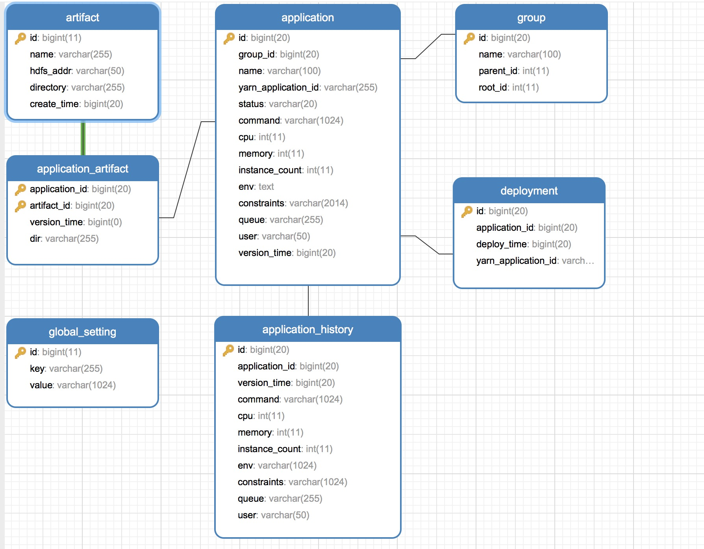
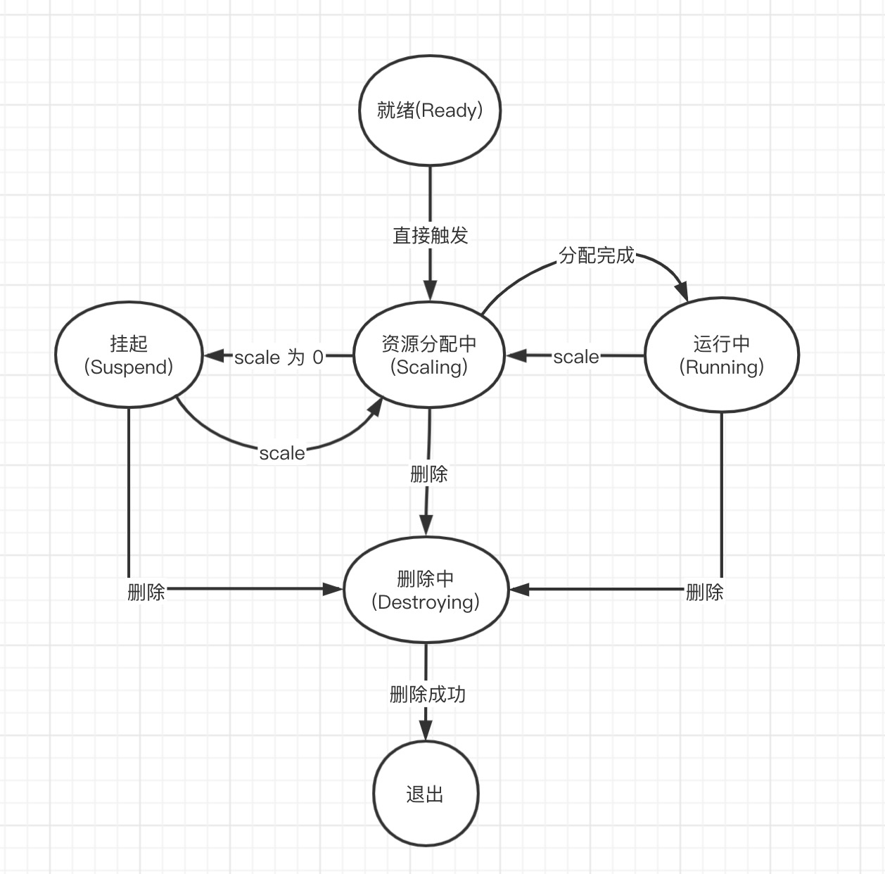

#初步数据库表格

#应用状态转换

# 文件管理
## 上传(目标位置不能存在同名文件)
### PUT     /api/artifact/upload
* file -  上传文件
* destDir - 目标目录
* fileName - 文件名（不传则以原始名称为准） 

## 通过URL上传
### PUT     /api/artifact/transfer
* url   - 源文件地址，支持http、ftp
* destDir - 目标目录
* fileName - 文件名（不传则以原始名称为准） 

## 删除
### DELETE      /api/artifact/{id}

## 查询
### POST    /api/artifact/list
* page 
* size
* filter
  - name 名称（模糊）
  - directory 目录（右模糊）
  - timeFrom 
  - timeTo
* sort
  - name
  - createTime 等同于ID排序

#应用
## 创建
### POST /api/app
* name - 名称
* groupId - 分组目录Id
* cpu - cpu 个数
* memory - 内存
* instanceCount - 实例个数 0 代表挂起
* command - 命令
* artifacts - 引用的文件Map， key 为artifactId，value 为解压目录可以为 null
* env - 环境变量 map 对象
* constraints - 约束
* user - 认证用户
* queue - 任务队列

## 删除
### DELETE /api/app/destroy/{appId}

## scale
### POST /api/app/scale/{appId}
* count 实例数，为0则执行挂起操作
* killContainerIds 需要被指定杀死的容器Id列表

## 应用信息查询
### GET /api/app/info

## 获取应用配置信息 (即获取历史)
### GET /api/application/{id}/configs

#分组目录管理
## 创建
### POST /api/group
* name - 名称，同级目录下不能重名
* parentId - 父级目录id,默认为 根目录(`-1`)

## 查询（展示子目录和application 摘要信息）
### GET   /api/group/list/{id}

## 删除 
### DELETE /api/group/{id}

