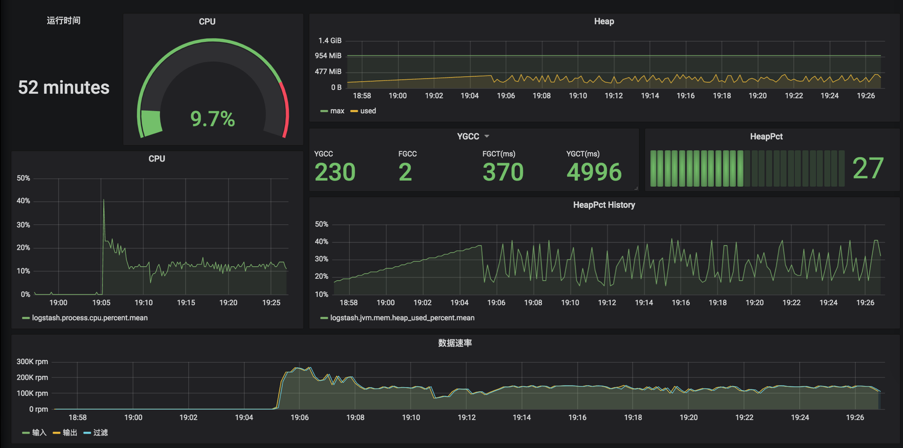
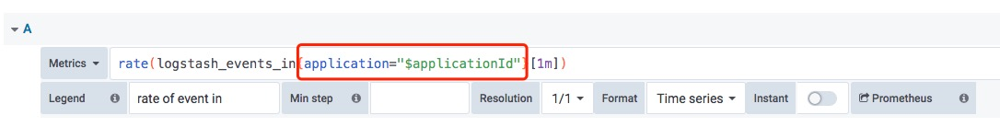

# plugin-logstash

该插件的目标是，在`marayarn`的基础上增加对logstash的多实例运行的监控和可视化。



`marayarn`的机制中，默认支持 [influxdb](https://www.influxdata.com/) 作为监控数据库，以及 [grafana](https://grafana.com/) 可视化对接。

在提交logstash应用时，只要指定如下三个环境变量作为ApplicationMaster环境变量，插件就会跟原生ApplicationMaster配合监控和数据可视化：

- `INFLUXDB_URL`：形如 `http://xxx.xxx.xxx.xxx:8086/api/v1/prom/write?db=xxx` 的influxdb接口地址
- `GRAFANA_BASE_URL` ：形如 `http://xxx.xxx.xxx.xxx:3000` 的grafana访问地址
- `GRAFANA_DASHBOARD_ID`：配置好的grafana报表Id

# INFLUXDB_URL

influxdb通过如下接口，支持Prometheus的remote write/read：

> /api/v1/prom/write?db=xxx

只需要事先在influxdb中创建一个db存储数据，并将url中的db=xxx替换为对应的数据库即可。

`marayarn`将监控数据写入influxdb也是采用这个接口的方式，这样做的好处是比较容易将原先支持Prometheus规范的软件产品对接到`marayarn`和influxdb。

# GRAFANA_BASE_URL和GRAFANA_DASHBOARD_ID

为了对监控指标进行展现和可视化，`marayarn`支持跳转grafana报表。用户应该首先自行安装grafana，并创建好dashboard。
dashboard需要添加`applicationId`作为文本变量，panel应使用`job=$_applicationId$`作为筛选。



`marayarn`会基于`GRAFANA_BASE_URL`和`GRAFANA_DASHBOARD_ID`生成grafana的url，用户可以通过如下链接直接跳转到当前applicationId的应用监控。


> 插件会把`applicationId`作为指标数据的job标签存入influxDb
> 
> 跳转需要事先在grafana系统登录

# logstash.yml

`plugin-logstash`利用logstash的内部监控组件实现监控数据的收集，参考
[Collect Logstash monitoring data using internal collectors](https://www.elastic.co/guide/en/logstash/7.3/monitoring-internal-collection.html) 。

> 无需担心xpack的license问题，因为logstash上送数据本质上不需要license，而是es端存储展现才需要

具体的说，通过在`logstash.yml`中配置如下，就可以让logstash把自监控数据上送到`ApplicationMaster`：

```
xpack.monitoring.enabled: true
xpack.monitoring.elasticsearch.hosts: ["${METRICS_PUSH_GATEWAY_ADDR:}"]
```

在这里，`plugin-logstash`假装自己是es，接收logstash主动上送的指标数据。
`plugin-logstash`配合`marayarn`在启动logstash的时候，设置环境变量`$METRICS_PUSH_GATEWAY_ADDR`，指向当前的ApplicationMaster的监听地址和端口。
`plugin-logstash`会处理logstash的请求，解析上送的数据，选取一些指标，转化并存储到influxdb，保存到`INFLUXDB_URL`指向的数据库。

> logstash出厂的配置并不开启这两个配置，需要事先设置好

# metrics

`plugin-logstash`当前只处理`logstash_stats`类型的指标数据。具体来说，`plugin-logstash`会将挑选如下指标：

```
process.cpu.percent
queue.events_count
jvm.mem.heap_used_in_bytes
jvm.mem.heap_used_percent
jvm.mem.heap_max_in_bytes
jvm.uptime_in_millis
jvm.gc.collectors.old.collection_time_in_millis
jvm.gc.collectors.old.collection_count
jvm.gc.collectors.young.collection_time_in_millis
jvm.gc.collectors.young.collection_count
events.in
events.filtered
events.duration_in_millis
events.out
```

# dashboard

TODO: dashboard的配置还在优化中，未来会提供导出的dashboard

# 提交任务示例

```
HADOOP_CONF_DIR=$PWD/hadoop marayarn_pkg/marayarn submit \
-am file:///$PWD/marayarn-am/target/marayarn-am-1.0-SNAPSHOT-jar-with-dependencies.jar \
-cpu 1 -memory 1024 -name logstash_test -instance 1 \
--file "file:///Users/pchou/Downloads/logstash.zip#dir" \
--file "file://$PWD/plugins/logstash/target/plugin-logstash-1.0-SNAPSHOT.jar" \
--file "file://$PWD/marayarn_pkg/logstash.conf" \
-cmd 'dir/logstash/bin/logstash -f logstash.conf --path.data=.' \
-e 'INFLUXDB_URL=http://192.168.21.50:8086/api/v1/prom/write?db=logstash1' \
-e 'GRAFANA_BASE_URL=http://192.168.21.90:3000' \
-e 'GRAFANA_DASHBOARD_ID=mjPtG_tMk'
```

上面的命令与普通提交任务不同的是，增加了`plugin-logstash-1.0-SNAPSHOT.jar`和上面提到的三个环境变量
